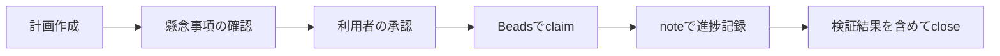

# my-codex-rules

Codex で使う `AGENTS.md`、初回セットアップ、Beads 進捗管理を配布する個人向けルール集です。

## 背景

Claude Code では `.claude/rules/` を利用していました。Codex は、永続的なリポジトリ規則に `AGENTS.md`、再利用可能な作業手順にスキル、実行前後の機械的な処理にフックを使います。

このリポジトリは、Beads 公式の Codex 統合を基盤にします。公式統合へ、プロジェクト初期セットアップ用スキルと記録漏れ通知用の `Stop` フックだけを追加します。

## 必要な環境

対応環境は Windows と PowerShell 7 以降です。次のコマンドが必要です。

| コマンド | 確認済みの版 | 用途 |
|---|---:|---|
| `codex` | 0.146.0 | Codex 本体 |
| `bd` | 1.1.2 | Beads の課題管理と公式 Codex 統合 |
| `jq` | 1.8.2 | 依存確認と診断 |
| `git` | 現在利用可能な版 | リポジトリ初期化と履歴確認 |

記載した版は検証時の値です。セットアップスクリプトは各コマンドの存在と版表示の成功を確認します。

## 内容物

| パス | 内容 |
|---|---|
| `rules/AGENTS.md` | 対象プロジェクトへ配布するルール本体 |
| `.prompts/INIT.md` | 要件確認、非破壊調査、Beads 初期化、質問作成の初回プロンプト |
| `skills/project-bootstrap/` | 初回セットアップを進める Codex スキルと配布テンプレート |
| `scripts/setup-beads.ps1` | Beads 公式 Codex 統合、スキル、記録漏れ通知の導入 |
| `scripts/teardown-beads.ps1` | 管理要素の削除または導入前バックアップの復元 |
| `scripts/bootstrap.ps1` | 対象プロジェクトの機械的な初期セットアップ |
| `scripts/beads-stop-nudge.ps1` | 未更新の作業中課題を通知する `Stop` フック |
| `scripts/verify-beads.ps1` | 一時利用者領域で導入と取り消しを検証するスクリプト |
| `tests/` | PowerShell 標準機能だけで動く単体テスト |
| `exclude` | 対象プロジェクトの `.git/info/exclude` へ追加する参考設定 |

## 計画ファイルと Beads の役割

`.prompts/PLANS` は設計内容と利用者の承認を残す場所です。`.prompts/DISCUSSIONS` は、計画を実行する前の懸念事項と選択肢を残す場所です。

Beads は実行中の状態、依存関係、ブロッカー、次に着手できる課題の正本です。Codex のセッション内プランは、現在のセッションで使うチェックリストに限定します。



短時間で完了する単発作業や回答だけの依頼は、Beads へ登録しません。

## Beads のグローバル導入

グローバル導入は利用者の Codex 設定を変更します。実行前に、Git 差分とスクリプトの内容を確認してください。

```powershell
pwsh -NoProfile -File scripts/setup-beads.ps1
```

スクリプトは次の順序で処理します。

1. `bd`、`jq`、`codex` の存在と版表示を確認します。
2. `$CODEX_HOME` の `AGENTS.md`、`hooks.json`、`config.toml` をバイト単位でバックアップします。
3. `bd metrics off` で匿名利用統計を停止します。
4. `bd setup codex --global` で公式スキルと公式フックを導入します。
5. `project-bootstrap` スキルと独自の `Stop` フックを追加します。

公式統合は、セッション開始、圧縮前、圧縮後、次回プロンプトで Beads コンテキストを更新します。独自フックは、15 分以上更新されていない `in_progress` 課題がある場合だけ記録を促します。入力や Beads の異常時は、Codex の作業を妨げないよう通知せず終了します。

セットアップは、コマンド文字列の完全一致ではなく `beads-stop-nudge.ps1` というスクリプト名で独自フックを識別します。利用者領域や `CODEX_HOME` を移設した後に再実行すると、古いパスの独自フックを削除し、現在のパスを使う 1 件だけを登録します。利用者が追加した別の `Stop` フックは保持します。

導入後は Codex で `/hooks` を開き、追加されたフックの内容を確認して信頼してください。Codex はフック定義のハッシュ単位で信頼を管理するため、コマンドが変わった場合は再確認が必要です。

## 対象プロジェクトの初期セットアップ

グローバル導入後は、Codex で `$project-bootstrap` を指定できます。コマンドだけで初期設定する場合は、次を実行します。

```powershell
pwsh -NoProfile -File scripts/bootstrap.ps1 -TargetPath D:\path\to\project
```

初期セットアップは、既存ファイルを上書きせず、次を行います。

- Git がない場合は `main` ブランチで初期化
- `AGENTS.md` と `.prompts/INIT.md` を未作成の場合だけ配置
- `.appendix`、`.tmp`、`.logs`、`.prompts`、`docs` の作業用ディレクトリを作成
- `.git/info/exclude` へ不足項目だけを追加
- `docs/INDEX.md` を未作成の場合だけ配置
- Beads を `--stealth` で初期化

`.beads-optout` がある場合、または `-NoBeads` を指定した場合は Beads を初期化しません。プロジェクト初期セットアップはグローバル Codex 設定、コミット、push を変更しません。

`project-bootstrap` が配置する `AGENTS.md` と `.prompts/INIT.md` はコピーです。本リポジトリを更新しても、配置済みのコピーは自動では更新されません。初期セットアップを再実行しても既存ファイルは上書きしないため、更新が必要な場合は本リポジトリとの差分を確認して対象プロジェクトへ反映してください。

## Beads の基本操作

```powershell
bd ready
bd update <id> --claim
bd note <id> <判明事項>
bd close <id> --reason <検証結果を含む完了理由>
```

継続的に必要な決定は `bd remember` に記録します。`.beads/` は進捗データを含むため、一時ファイルとして削除しないでください。`bd dolt push` は外部への書き込みです。利用者が明示的に指示した場合だけ実行してください。

## 取り消し

通常の取り消しは、Beads と本リポジトリが管理する要素だけを削除します。導入後に利用者が追加した Codex 設定は保持します。

```powershell
pwsh -NoProfile -File scripts/teardown-beads.ps1
```

導入前の `AGENTS.md`、`hooks.json`、`config.toml` をバイト単位で復元する場合は、`-Restore` を指定します。

```powershell
pwsh -NoProfile -File scripts/teardown-beads.ps1 -Restore
```

`-Restore` は、セットアップ後に加えた Codex 設定も失わせます。スクリプトは警告を表示し、公式統合を削除してからバックアップを復元します。`bd metrics off` の設定と各プロジェクトの `.beads/` は取り消しません。

配置済みの `project-bootstrap` スキルまたは通知スクリプトに利用者の変更がある場合は、自動削除せず警告します。

## テスト

単体テストは次のコマンドで実行します。

```powershell
pwsh -NoProfile -File tests/run.ps1
```

隔離統合検証は一時的な `HOME`、`USERPROFILE`、`CODEX_HOME` と Git リポジトリを使います。実際の利用者領域へグローバル統合を導入しません。

```powershell
pwsh -NoProfile -File scripts/verify-beads.ps1
```

自動検証の対象は、設定生成、冪等性、バックアップ復元、偽のフック入力、Beads 課題操作です。実際の Codex セッションでのフック信頼と発火確認は、成果物のレビュー後に行う受け入れ確認として分離します。

## 制約

現在のスクリプトは Windows と PowerShell 7 以降を対象とします。POSIX 環境は未対応です。

Codex の公式統合と本リポジトリの設定は、利用者のホームディレクトリへ書き込みます。実環境へ適用する前に、隔離検証結果と差分を確認してください。

## ライセンス

MIT License です。詳細は `LICENSE` を参照してください。

## 更新履歴

| バージョン | 日付 | 内容 |
|---|---|---|
| v1.2.0 | 2026-08-08 | 移設前の `Stop` フックをスクリプト名で検出し、現在のパスへ置き換える処理と回帰テストを追加。エラーと証拠なしを区別する行動原則、初期セットアップで配置したコピーが上流更新へ自動追随しない制約を追記 |
| v1.1.0 | 2026-08-08 | Beads 公式 Codex 統合、進捗管理規則、初回セットアップスキル、記録漏れ通知、導入と取り消し、隔離検証を追加 |
| v1.0.0 | 2026-07-20 | 事実の検証、調査の先行、判断と報告、外部操作と破壊的操作、自然な日本語、実環境テストなどの行動原則を追加 |
| v0.2.0 | 2026-06-06 | プラン作成後の懸念点洗い出し、調査先行、文書蓄積、TDD 原則を追加 |
| v0.1.0 | 2026-03-13 | 初版 |
